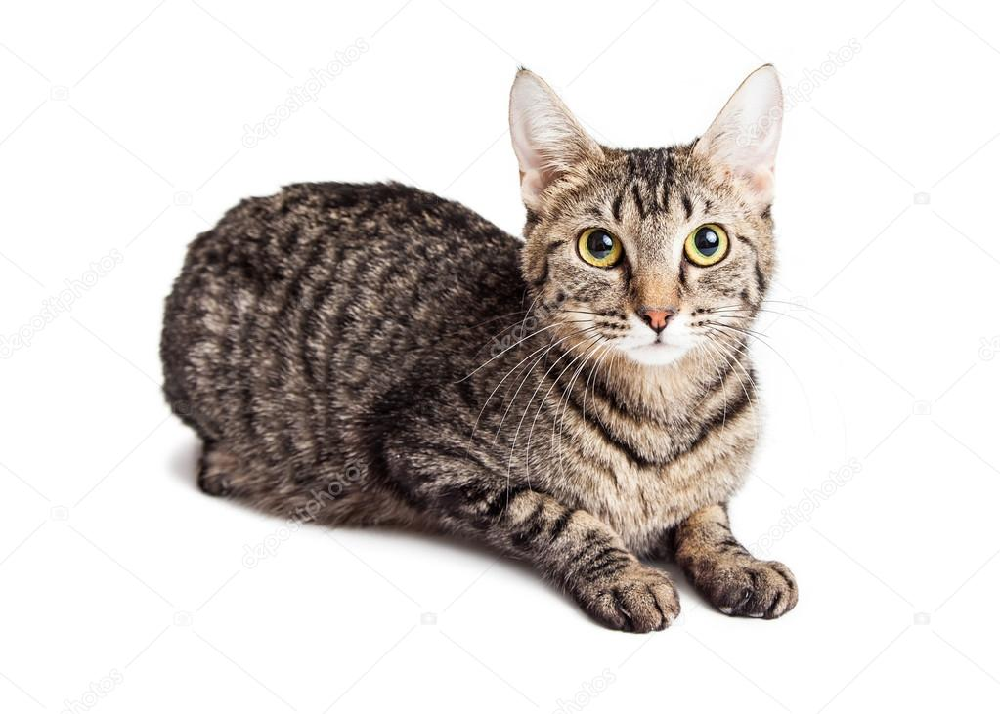
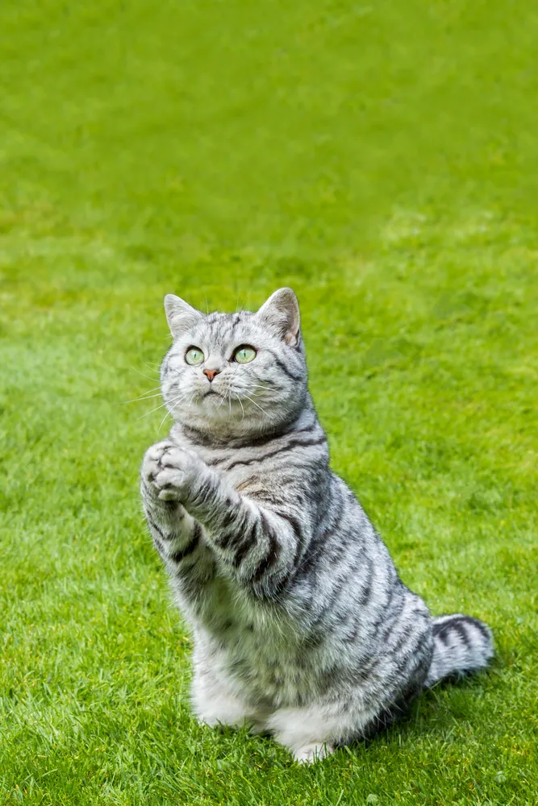
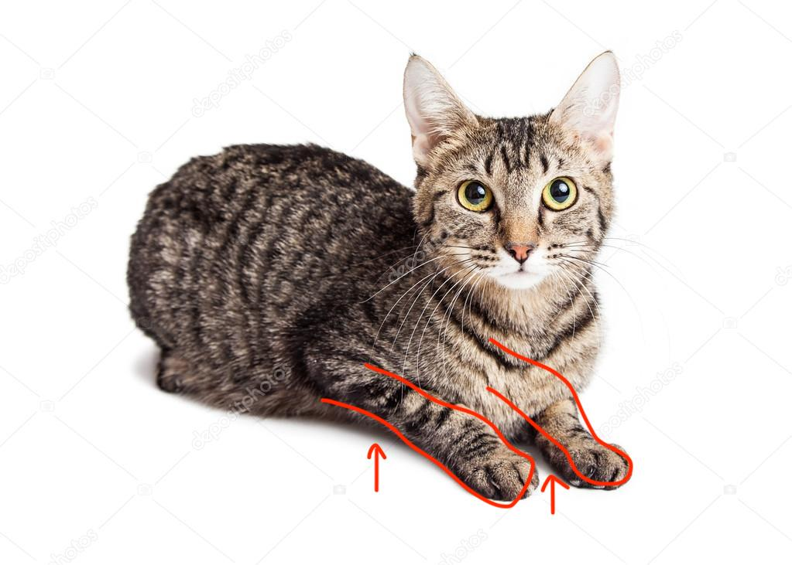
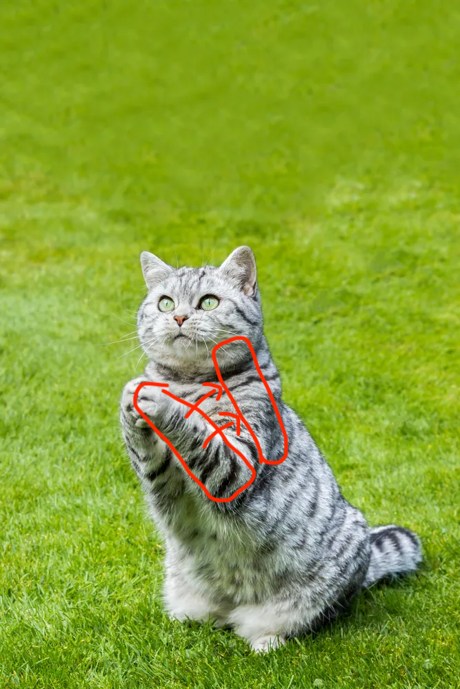
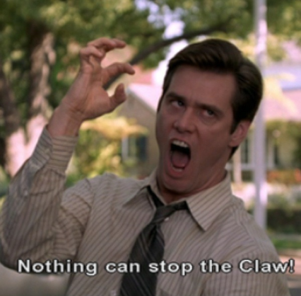
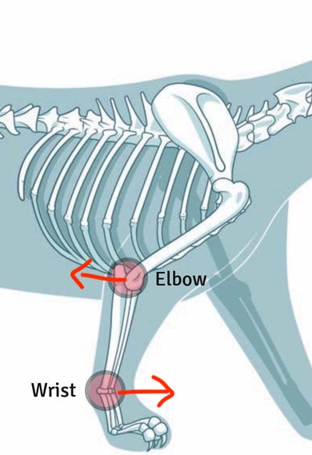
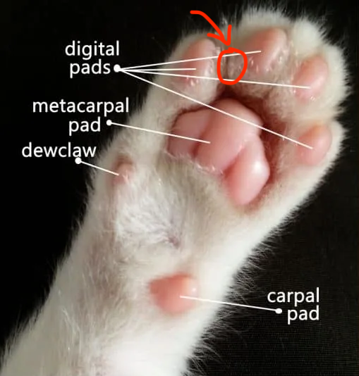
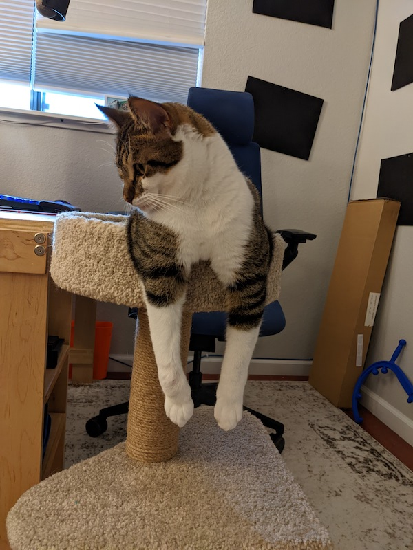

<h1 id="top">Eri Survival Guide</h1>

<h2 id="emergency">Emergency Contacts</h2>

> Emergency vet (open 24/7)  
Located in San Mateo  
> 
> <a href="https://g.page/lenityvets" target="_blank">Google Maps</a>  
> 
> <a href="tel:16505136660">650-513-6660</a>

> Regular vet (Mon-Sat, 8AM - 5PM)  
Located in San Bruno  
> 
> <a href="https://g.page/SanBrunoPet" target="_blank">Google Maps</a>  
> 
> <a href="tel:16505835039">650-583-5039</a>

> Physio vet (Mon/Tue/Thu/Fri 8AM - 5PM)  
Located in San Mateo  
> 
> <a href="https://goo.gl/maps/c7LxaQcdZB65TchF7" target="_blank">Google Maps</a>  
>   
> <a href="tel:16503281430">650-328-1430</a>

# Rules
1. Absolutely no people food
2. If you stay the night, she is not allowed in the bedroom with you at night

<h1 id="needs">Eri's Hierarchy of Needs</h1>

Anything below P2 is pretty extra and you really don't need to worry about it.

## P0
* Rinse & refill water bowls (kitchen + office)
* Refill dry food ([detail](#food))
* Make sure she's still alive :)

## P1
* Spend 15-30 mins with her (play/cuddle/pets)

## P2
* Play with her *more*
* Give her some wet food ([detail](#food))
* Do a few minutes of [exercises](#exercises) before play time. Give her some treats after :3

## P3
* Vaccuum up any stray litter that she tracks too far from her litter boxes
* Clicker training

## P4
* Clean out litter boxes ([detail](#litter-box))

<h1 id="detail">Specifics</h1>

## Food
### Dry food
Eri eats about 1/3 - 1/2 cup of dry food each day. Her dry food is on the top shelf in the pantry. The scoop inside is about 1 cup, so I typically eyeball a half scoop. You can give her as much dry food as you want - she is a free-feeder.

### Wet food
I usually keep partial cans of her wet food on the top shelf in the fridge. I have some silicon lids that fit on top of the open cans to keep them fresh. Unopned cans are in the pantry. Eri will usually only eat about 1/4 - 1/3 of the can, so I don't bother trying to give her more than that at a time. You can give her wet food 1-2 times each day.

### Treats
Eri has some treats all over. There's a bag of treats on the kitchen counter, various treats in the "Cat Supplies" bin in the office, and a bag of treats in the "Cat Toys" bin in the den. You can basically give her as many treats as you want.

## Litter Box
*I absolutely do not expect you to clean Eri's litter box(es)*, but if you wish to do so, I have a "Litter Genie" (usually kept beside one of her litter boxes). Simply use the scoop on the side of the genie to sift any clumps/poops out of the litter and put it in the chute in the top of the genie. Pull out the handle/shelf on the front of the genie to drop the debris into the collection bag below.

<h1 id="exercises">Exercises</h1>

She is supposed to get 2 rest days per week, so I only do exercises with Eri on weekdays. Our usual routine lately is:  
- [stretches](#stretches)
- [leg massage](#leg-massage)
- [paw rubs](#paw-rubs)
- [tripoding](#tripoding) or [belly pulls](#belly-pulls)
- [chair lifts](#chair-lifts)

You'll want to start every exercise (except for chair lifts) sitting on your knees with Eri sitting/loafing in front of you.

### Stretches
**Goal**: Keep major joints flexibility on par (shoulder, elbow) for each front leg  
Hold a light stretch for 5-10 seconds.

Pick up Eri's front legs and hold them to her side (as they would be if she was laying down). Her back legs should stay on the ground, so she's in a sort of "begging" position in front of you, facing away.

&nbsp; | &nbsp;
-- | --
 | 

Apply pressure to the legs and gently squeeze her against your chest. Use her left leg as a guide for how much flexibility to expect. 

&nbsp; | &nbsp;
:-:|:-:
 | 

She will generally cooperate with this exercise.

### Leg Massage

**Goal**: Happy kitty :)  

As in [stretches](#stretches), you want her in a "begging" pose. Use your left hand to support her upper body, and your right hand to gently massage the muscles in her right front leg. Start with her upper leg, then foreleg, then finally gently "smoosh" her paw. When massaging the paw, imagine you are trying to make the paw do "the claw hand" by pushing down on her toes while pushing up on her main (metacarpal) paw pad.

She tends to enjoy this, so spoil her as much as you like.

### Paw Rubs

**Goal**: Nerve stimulation in paw. Flexibility in toes/paw. Increase skin toughness in paw pad.  
About 5 reps

With Eri sitting in front of you (facing away). Steady her with your left hand (you may have to hold her up), and use your right hand to guide her right paw into a rubbing motion. Place the paw ahead of her, and apply light pressure to the top of the paw as you drag it backwards along the surface of the exercise mat. You should feel her toes moving up and down as they go over the bumps in the mat.

She will typically put up with about 5-10 reps of this.

### Tripoding

**Goal**: Muscle building, stability. Getting her used to standing/sitting "correctly"  
About 5-10 reps

With Eri sitting in front of you (facing away), use your left hand to stabilize her and keep her in place. Her natural response when placing her right leg is to let her elbow bend back and her wrist bend forward.

Your job is to apply *horizontal* pressure to keep the leg & joints in a more correct position. Now either gently shove her side-to-side to get her to put some weight on each leg in turn, or alternate between lifting each leg so she doesn't have much choice but to weight bear on the other leg.

She does not typically cooperate with this exercise, but she lets it happen for a time.

### Belly Pulls

**Goal**: Strengthen foreleg, elbow, and wrist muscles. Encourage correct placement behavior.  
Up to 5 reps (if she'll let you).

Start with Eri sitting in front of you (facing away). Bring her right paw backwards, behind her left leg. Position it as if she were trying to use her right paw to scratch her (rear) left knee. Use your left hand to gently hold the paw in place, and allow her to pull the paw away and place it in front of her. Provide just a little bit of resistance so she has to work her muscles slightly. If she doesn't want to pull the paw, use your left hand to gently pinch the skin between her first and second toes.

The goal isn't to actually "pinch" her, but just to kind of bug her so she wants to pull her paw away.

Ideally, we want her to place that right paw correctly (ie. paw pads down) when she does this.

If she puts up with more than 1 rep of this, you are lucky.

### Chair Lifts

**Goal**: Strengthen upper leg. Encourage correct placement behavior.  
3-5 reps.

Pick Eri up. Use your left hand under her back legs to support her back, and place your right hand on her chest (behind her front legs) to support her front. You want her front legs to be dangling in front of her.

Bump her chest right up against the chair. She should know this exercise well enough to know what to do. You want her to lift each front paw up and place it on the chair correctly. Typically, she will try to swing her right leg out to the side instead of lifting it in front of her. If you can, use your hand to prevent that. If not, rotate her 45&deg; counter-clockwise so that she cannot lift her leg by swinging it out to the right.

Once she's done a few of these, I let her climb up out of my hands and onto the chair.